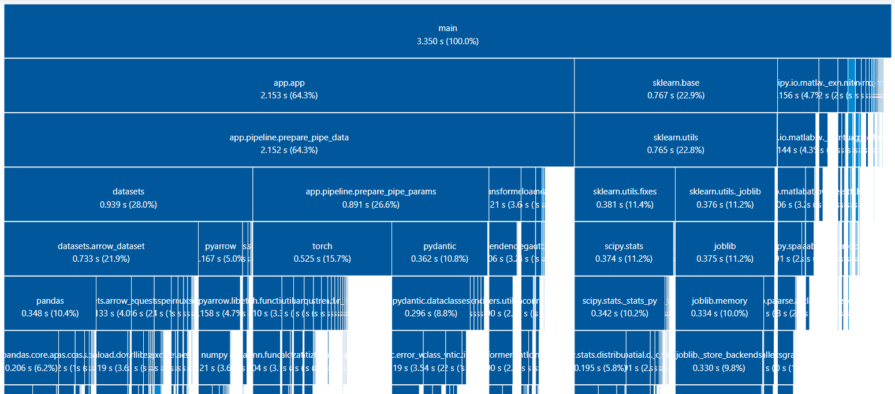
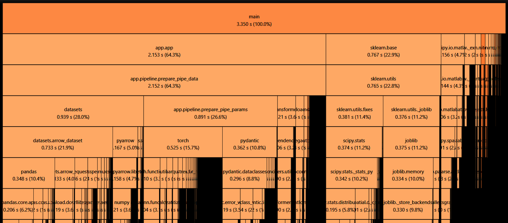

App-K8s-HF-WnB
===

[](https://cirrus-ci.com/github/gte77/App-K8s-HF-WnB)
[](https://www.codefactor.io/repository/github/qte77/App-K8s-HF-WnB)
[](https://github.com/qte77/App-K8s-HF-WnB/actions/workflows/links-fail-fast.yml)
[](https://wakatime.com/badge/github/qte77/App-K8s-HF-WnB)
<!--
[](https://github.com/qte77/App-K8s-HF-WnB/actions/workflows/codeql.yml)
[](https://github.com/qte77/App-K8s-HF-WnB/actions/workflows/linter.yml)
--->

This project aims to create an end-to-end ML app as a functional MVP.
The app itself uses Hugging Face (HF) and Weights&amp;Biases (WandB) to reduce initial complexity. The ML modules used should be interchangeable without interrupting the pipeline. The app can be deployed into a Python venv, a Docker image and Kubernetes to showcase the separation of concerns of the different pipeline components.

Status
---

**[DRAFT]** **[WIP]** **----> Not fully implemented yet**

The current version is <3.0.0>. For version history have a look at [CHANGELOG.md](./CHANGELOG.md).

Quickstart
---

* TODO <!-- `make run_all` -->

TOC
---

* [Usage](#usage-)
* [Install](#install-)
* [Reason](#reason-)
* [Purpose](#purpose-)
* [Paradigms](#paradigms-)
* [App Structure](#app-structure-)
* [App Details](#app-details-)
* [TODO](#todo-)
* [Inspirations](#inspirations-)
* [Rescources](#resources-)

Usage [↑](#app-k8s-hf-wnb)
---

If inside `poetry` venv

```sh
python -m app
```

or if outside

```sh
poetry run python -m app
```

Install [↑](#app-k8s-hf-wnb)
---

### Python

From a venv with available `poetry`

```sh
make install
```

or with `conda`

```sh
envname='App-K8s-HF-WnB'
conda create -ym -n $envname poetry
conda activate $envname
make install
```
<!--
or with `conda-forge`

```sh
conda install -c conda-forge pipfile
```
-->

### Container

* TODO <!-- `make build` -->

### Kubernetes

* TODO <!-- `make k8s-prod` or `make k8s-test` -->

Reason [↑](#app-k8s-hf-wnb)
---

* TODO

Purpose [↑](#app-k8s-hf-wnb)
---

* Showcase an end-to-end app with train and inference mode
* Implement self-contained modular pipeline

Paradigms [↑](#app-k8s-hf-wnb)
---

* TDD/BDD
* Mostly functional
* Time-to-value, time-to-market
* Light-weight
* Code should (Dave Farley)
  * Work
  * Be modular
  * Be cohesive
  * Be appropriatly coupled
  * Be separated by concerns
  * Hide/abstract information

App Structure [↑](#app-k8s-hf-wnb)
---

<details>
<summary>Show essential structure</summary>
<pre>
/
├─ app/
│  ├─ config/
│  ├─ payload/
│  ├─ pipeline/
│  ├─ utils/
│  └─ app.py
├─ assets/
├─ container/
├─ kubernetes/
│  ├─ base/
│  └─ overlay/
├─ tests/
├─ CHANGELOG.md
├─ make.bat
├─ Makefile
├─ pyproject.toml
└─ README.md
</pre>
</details>

<details>
<summary>Show full structure</summary>
<pre>
/
├─ .github/
│  ├─ workflows/
│  │  ├─ links-fail-fast.yml
│  └─ dependabot.yml
├─ app/
│  ├─ config/
│  │  ├─ defaults.yml
│  │  ├─ huggingface.yml
│  │  ├─ logging.conf
│  │  ├─ parameters.dummy.json
│  │  ├─ sweep-wandb.yml
│  │  ├─ sweep.yml
│  │  ├─ task.yml
│  │  ├─ wandb.key.dummy.yml
│  │  └─ wandb.yml
│  ├─ payload/
│  │  ├─ handle_hf.py
│  │  ├─ handle_sweep.py
│  │  ├─ infer_model.py
│  │  └─ train_model.py
│  ├─ pipeline/
│  │  ├─ load_hf_components.py
│  │  ├─ prepare_pipe_data.py
│  │  └─ prepare_pipe_params.py
│  ├─ utils/
│  │  ├─ handle_logging.py
│  │  ├─ handle_paths.py
│  │  ├─ load_configs.py
│  │  ├─ log_system_info.py
│  │  ├─ parse_args.py
│  │  └─ toggle_features.py
│  ├─ __main__.py
│  ├─ __version__.py
│  ├─ _version.py
│  ├─ app.py
│  └─ py.typed
├─ assets
│  ├─ tuna_importtime_dark.PNG
│  └─ tuna_importtime_light.PNG
├─ container/
│  └─ Dockerfile.PNG
├─ kubernetes/
│  ├─ base/
│  │  ├─ deployment.yml
│  │  ├─ kustomization.yml
│  │  ├─ pvc.yml
│  │  └─ service.yml
│  └─ overlay/
│     ├─ prod/
│     │  ├─ ingress.yml
│     │  ├─ kustomization.yml
│     │  └─ namespace.yml
│     └─ test/
│        ├─ ingress.yml
│        ├─ kustomization.yml
│        └─ namespace.yml
├─ tests/
│  ├─ behavior/
│  │  ├─ test_load_hf_components_behavior.py
│  │  └─ test_train_model_behavior.py
│  └─ functionality/
│  │  └─ test_load_hf_components_functionality.py
├─ .bumpversion.cfg
├─ .cirrus.yml
├─ .coveragerc
├─ .flake8
├─ .gitattributes
├─ .gitignore
├─ .gitmessage
├─ .markdownlint.yml
├─ .pre-commit-config.yaml
├─ .yamllint.yml
├─ CHANGELOG.md
├─ LICENSE
├─ make.bat
├─ Makefile
├─ pyproject.toml
└─ README.md
</pre>
</details>

App Details [↑](#app-k8s-hf-wnb)
---

* App accepts only `.yml` as config right now
* [`config/wandb.key.dummy.yml`](./app/config/wandb.key.dummy.yml) showcases a keyfile to be used with the provider Weights&Biases (wandb)
* [`config/parameters.dummy.json`](./app/config/parameters.dummy.json) presents an example of the data model the pipeline uses

### Import performance

The import performance of the app can be measured with `python -X importtime -m app` and visualized with [tuna](https://github.com/nschloe/tuna). From root this flow can be invoked by:

```sh
make importtime
```

An example how the visualized import time could look like

[](./assets/tuna_importtime_light.PNG#gh-light-mode-only)
[](./assets/tuna_importtime_dark.PNG#gh-dark-mode-only)

TODO [↑](#app-k8s-hf-wnb)
---

### ML

* [x] Get WandB sweep config
  * Implemented and functional
  * May be extended to other providers, but for MVP sufficient
* [ ] Save models, datasets, tokenizer and metrics in local folder other than cache
* [ ] Define the core of the app
  * [ ] `train`
  * [ ] `infer`

### Coding

* [x] Basic exception handling
  * May be problematic with function returns
* [x] Type hinting in function calls
  * Implemented to improve readability
  * May be extended with [`typing`](https://docs.python.org/3/library/typing.html), [`dataclasses`](https://docs.python.org/3/library/dataclasses.html), [`pydantic`](https://github.com/pydantic/pydantic) or [`Typer`](https://github.com/tiangolo/typer)
* [x] Read multiple yml inside one file inside config loader
  * Abondoned, adds unnecessary complexity, use separate yml
* [x] Expand into [typing — Support for type hints](https://docs.python.org/3/library/typing.html)
* [x] Use `if` for to check if feature can be provided properly instead of `Ecxeption` to catch it
* [x] Try `dataclass` and `field` from [`dataclasses`](https://docs.python.org/3/library/dataclasses.html)
  * Used to auto add special classes like `__init__`, `__str__`, `__repr__`
  * Uses type hinting and decorators
* [x] Factor out `Pipeline.py` to prepare for functional only
  * Sole purpose of `Pipeline.py` is to represent the gathered configs
  * Replaced by dataclasses
  * Switch to recursion instead of for-loops for FP
* [x] Propagate debug state through app
  * Env `APP_DEBUG_IS_ON` checked by modules and written to `global debug_on_global`
* [x] Use `omegaconf` to load configs instead of own helper implementation
  * This package manages loading of configs from json or yaml
  * Offers type checking at load-time with [Structured configs](https://omegaconf.readthedocs.io/en/2.2_branch/structured_config.html#simple-types)
* [x] Align to [PEP 257 – Docstring Conventions](https://peps.python.org/pep-0257/)
  * Multi-line docstrings
* [x] Try [`argparse`](https://docs.python.org/3/library/argparse.html)
  * Fetch user or command input
* [x] Check `dataclasses` whether
  * It is suitable for functional programming
    * Low priority right now, design choice for a later stage
  * It is a code smell because it does not provide behavior but only a structure
    * Designed to hold data, may be comparable to `struct`and `enum`
* [x] Have a look at [PyTest](http://pytest.org/)
  * Explored in repo `TDD-Playground`
* [x] Line-continuation inside docstrings
* [ ] Incorporate test objects
  * Fake, Mock, Stub
* [ ] Refactor logging according to Martin Fowler [Domain-Oriented Observability](https://martinfowler.com/articles/domain-oriented-observability.html)
  * [ ] Domain Probing 'A Domain Probe[...] enables us to add observability to domain logic while still talking in the language of the domain'
  * [x] Decouple logging into dedicated functions and module
  * [x] Define logging types, e.g. `log`, `metrics`, `analytics`
* [x] Explore [feature toggles](https://www.martinfowler.com/articles/feature-toggles.html)
  * [ ] Testing the logging and observability
* [ ] Test [`pydantic`](https://pydantic-docs.helpmanual.io/) for type checking
  * `pydantic` build for parsing and checking types at runtime
  * If the app uses data it produced only by itself, it may not be suitable because of speed loss
  * Use `pydantic.BaseModel` or `pydantic.dataclasses.dataclass`
  * Read in and validate mode at the same time
  * Try to unpack yaml into pydantic w/o customized parsing before
  * `BaseSettings`could be useful to combine files and env
* [ ] Use `hydra` to parametrize the app
  * Hydra supports importing of custom `dataclasses.dataclass`
* [ ] Decouple concerns into separate containers, e.g. avoid big container because of `torch`
  * Difference between Abstraction vs Decoupling
  * Difference between Cohesion and Coupling
* [ ] Implement basic API, e.g. with [gunicorn](https://github.com/benoitc/gunicorn) or [FastAPI](https://github.com/tiangolo/fastapi)
* [ ] Use [distroless containers](https://github.com/GoogleContainerTools/distroless)
  * Reduce signal to noise ration of scanners
  * Reduce size

### Dependency tracking and packaging

* [x] Explore use of [pipenv with Pipfile & Pipfile.lock](https://pipenv.pypa.io/en/latest/basics/) as a [proposed replacement](https://github.com/pypa/pipfile#the-concept) to `requirements.txt`
  * Auto-creation of venv
  * `pipenv install -e` for [editable mode](https://pipenv.pypa.io/en/latest/basics/#a-note-about-vcs-dependencies), i.e. 'dependency resolution can be performed with an up to date copy of the repository each time it is performed'
* [x] Use `Poetry` as replacement for `pipenv`
  * Auto-creation of venv
  * Build-tool for packaging
* [x] Experiment with [`pyproject.toml`](https://pip.pypa.io/en/stable/reference/build-system/pyproject-toml/) to build app wheel
  * Used to pool information for build, package, tools etc into one file
  * Some tools like `flake8` do not support this approach
* Create a package
  * Required for `tox` and `pdoc`
  * [x] Experiment package as [single source app version](https://packaging.python.org/guides/single-sourcing-package-version/) with `setup.py` and [`hatchling`](https://hatch.pypa.io/latest/) or [`setuptools`](https://setuptools.pypa.io/en/latest/)
  * [x] Experiment with [`poetry`](https://python-poetry.org/docs/)

### Project management

* [x] Use `Makefile` instead of self-implemented imparative `setup.sh`
  * Implemented and functional
  * Need improvement for local venv install, because `source` can not run inside `make`
* [x] Adopt [CHANGELOG.md](https://keepachangelog.com/en/1.0.0/)
  * 'A changelog is a file which contains a curated, chronologically ordered list of notable changes for each version of a project.'
  * Seems to be reasonable
* [x] Adopt [SemVer](https://semver.org/) for semantic versioning
  * Seems to be reasonable
* [x] Implement basic CI/CD-Skeleton
  * Using `bump2version`, `pre-commit`, `black` etc
  * Rationale:
    * Get fast feedback
    * Raise confidence in codebase
    * Always keep codebase in releasable state
* [ ] Adopt TDD/BDD as described by Dave Farley [TDD Is The Best Design Technique](https://www.youtube.com/watch?v=ln4WnxX-wrw) and [TDD vs BDD](https://www.youtube.com/watch?v=Bq_oz7nCNUA)
  * Goals
    * Think of specification first, then test
    * Confirm behavior instead of testing the code
  * Structure
    * Specification (Test Suite) ==> Test (Szenario) ==> "Given, When, Then"
  * Sequence
    * Red: Write test ==> Green: Write code passing test ==> Blue Refactor code and test
    * Test: Arrange ==> Act ==> Assert ==> Clean
  * Frameworks Gherkin and Cucumber
* [x] Move from `Makefile` to [Cirrus CLI](https://github.com/cirruslabs/cirrus-cli)
  * Use `--dirty` for write-backs to files instead of `rsync` instance, e.g. for `isort`
* [ ] Implement pydoc-action to auto-generate into gh-pages /docs, e.g. [Sphinx Build Action](https://github.com/marketplace/actions/sphinx-build) for [Sphinx](https://www.sphinx-doc.org/en/master/usage/quickstart.html)

Inspirations [↑](#app-k8s-hf-wnb)
---

* Martin Fowler
  * [Software Architecture Guide](https://martinfowler.com/architecture/)
  * [Agile Software Guide](https://martinfowler.com/agile.html)
  * [Domain-Oriented Observability](https://martinfowler.com/articles/domain-oriented-observability.html)
* Dave Farley
  * [TDD Is The Best Design Technique](https://www.youtube.com/watch?v=ln4WnxX-wrw)
  * [Test Driven Development vs Behavior Driven Development](https://www.youtube.com/watch?v=Bq_oz7nCNUA)
* Ian Cooper
  * [🚀 TDD, Where Did It All Go Wrong (Ian Cooper)](https://www.youtube.com/watch?v=EZ05e7EMOLM)
* [Using Cirrus CLI instead of Makefiles for gRPC code generation](https://medium.com/cirruslabs/using-cirrus-cli-instead-of-makefiles-for-generating-grpc-87b949a67449)

Resources [↑](#app-k8s-hf-wnb)
---

* TODO
